# The Complex Fractals

A fractal is normally a self-similar shape, which means that a section of the shape is exactly the same as the entire shape as a whole.

  

# The Mandelbrot Set

The Mandelbrot Set is the set that contains all points that stay bounded to within an arbritary number called the "escape radius" when the formula 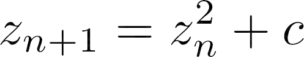 is applied multiple times, where c is any point on the plane.

  

# The Julia Set

PLACEHOLDER

  

# Try it out

Click [here](https://theicycoldpenguin.github.io/Fractals-Math-Art-Integration/) to try it out for yourself!

  

# How to Interact

-   To move around, simply click and drag your mouse around on the canvas
-   To zoom in or out press the "+" and "-" keys on your keyboard
-   To change the resolution of the render, drag the "Max iterations" slider around.
    -   Do note that slower computers might have trouble handling higher resolutions.
    -   An interesting activity would be to move the slider all the way to the left, and slowly nudge it to the right. This allows you to see how the image gets more detailed as the number of iterations increases.
-   To see the corresponding Julia Set for any point on the plane, simply click on that point while holding the shift key. An image will pop up giving a small view of the set

  

# Gallery

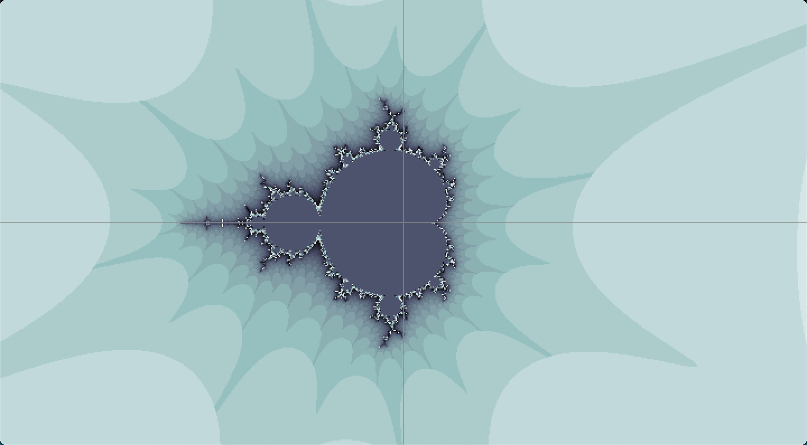 
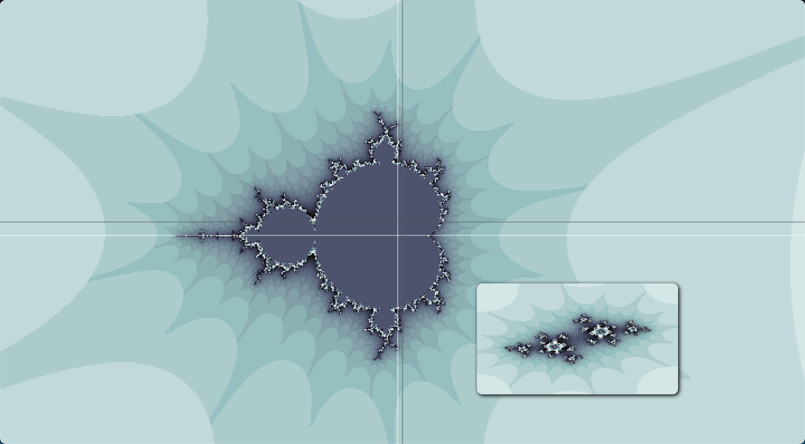 
 
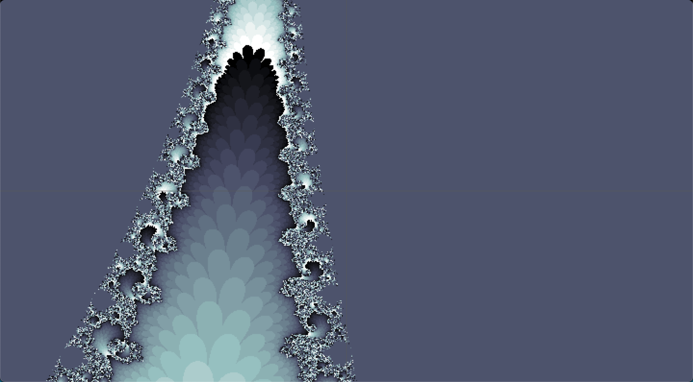 
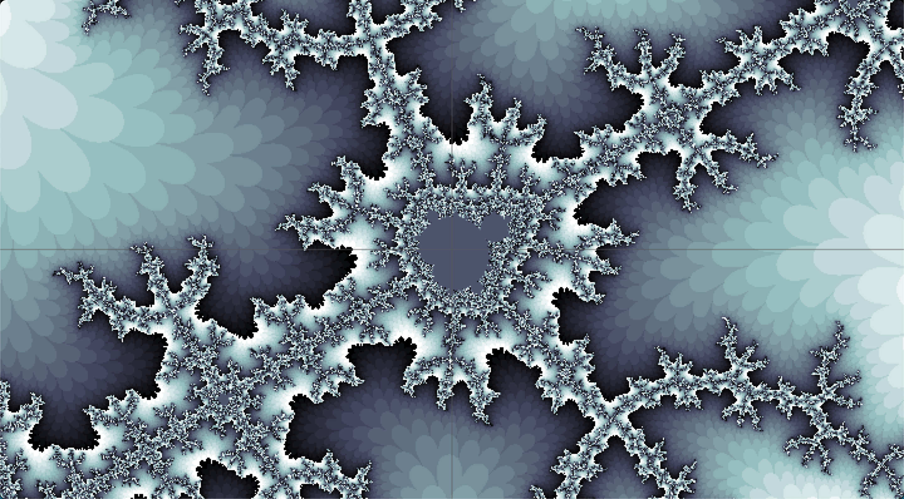 
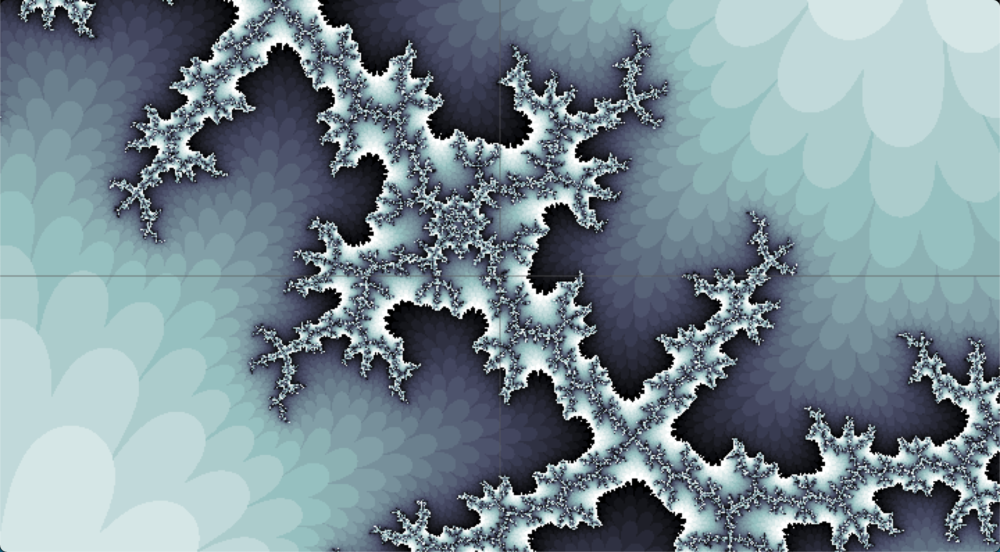 
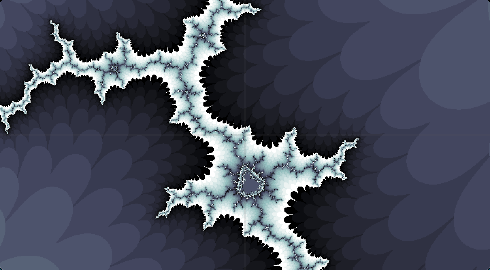 
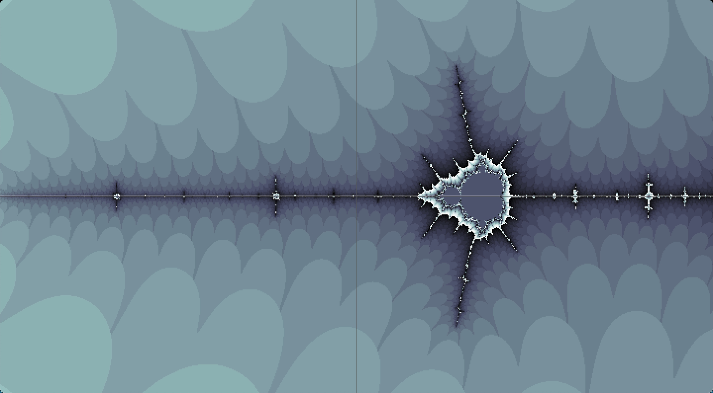 
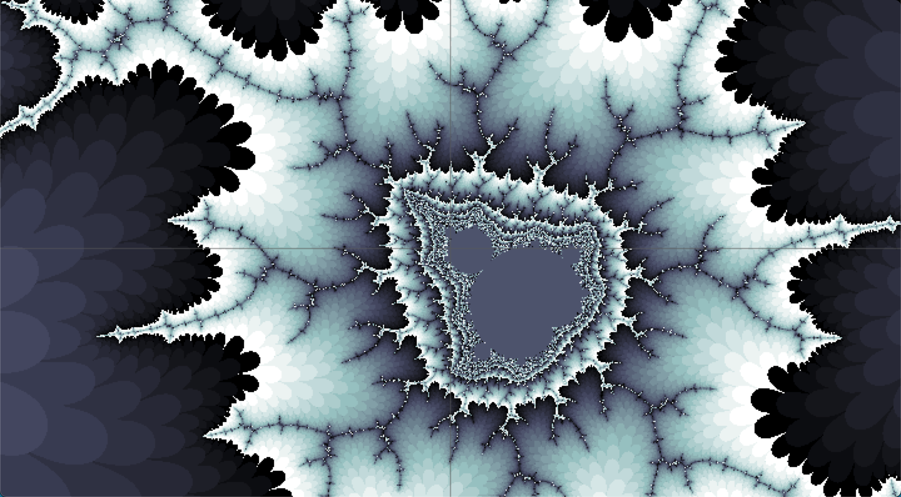 
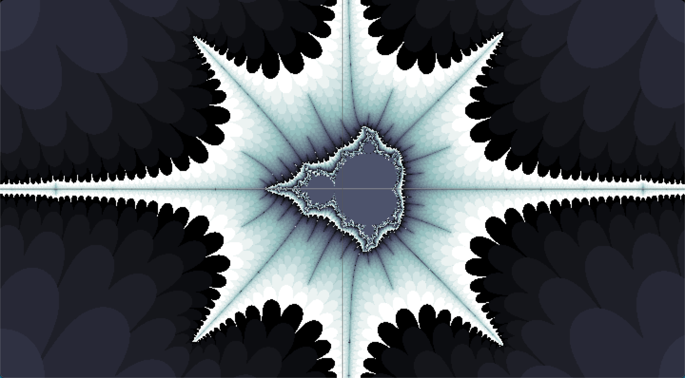 
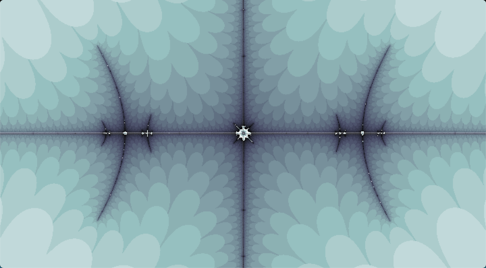 
