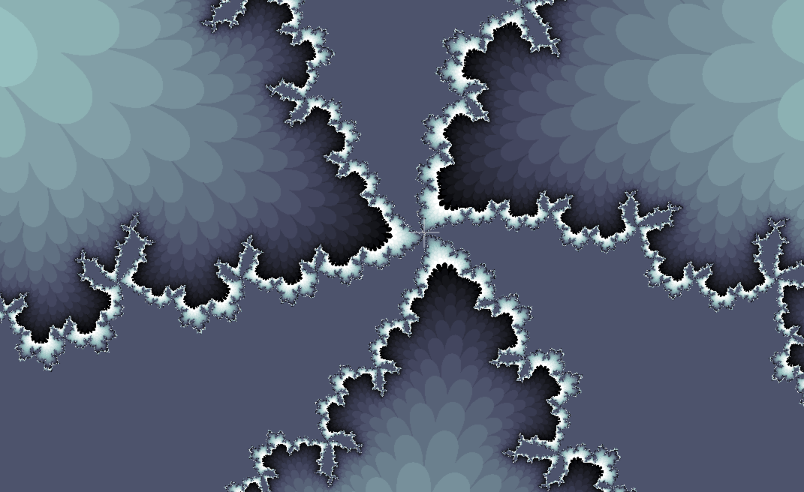
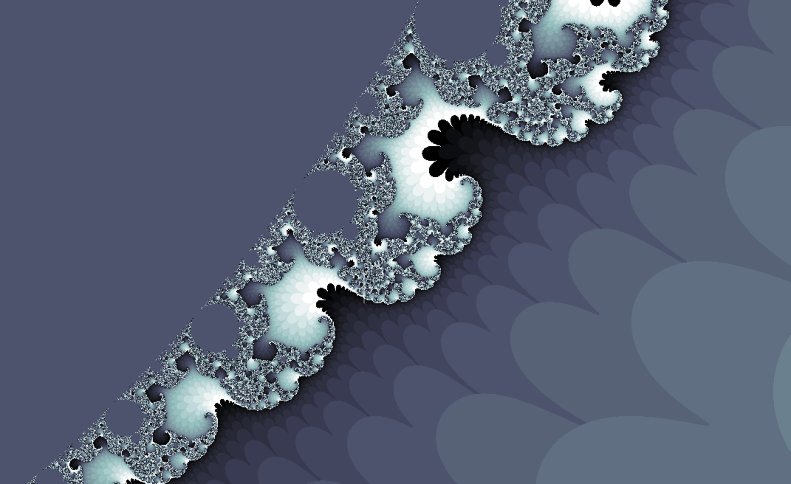

# The Complex Fractals

A fractal is usually a self-similar shape, which means that a smaller section of the shape is exactly the same as the entire shape as a whole.

  

# The Mandelbrot Set

The Mandelbrot Set is the set of all points `c` that do not escape to infinity on infinite iterations of the formula  where z0 is `0`

  

# The Julia Set

It is the collection of all complex numbers `z` that do not tend to infinity on infinite iterations of the function  over a constant `c`.

  

# Explore

Click https://theicycoldpenguin.github.io/Fractals-Math-Art-Integration to try it out for yourself.

  

# How to Interact

-   To move around, simply click and drag your mouse around on the canvas
-   To zoom in or out press the "+" and "-" keys on your keyboard
-   To change the resolution of the render, drag the slider on the top left around.
    -   Do note that slower computers might have trouble handling higher resolutions.
-   To see the corresponding Julia Set for any point on the plane, simply click on that point while holding the shift key.

  

# Gallery

 
 
 
 
 
 
 
 
 
 
 
 
 
